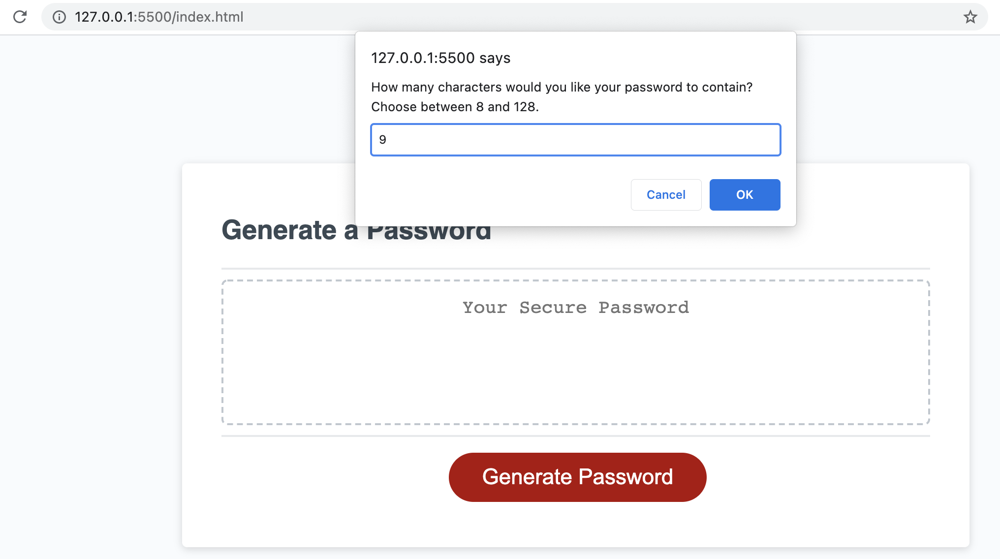
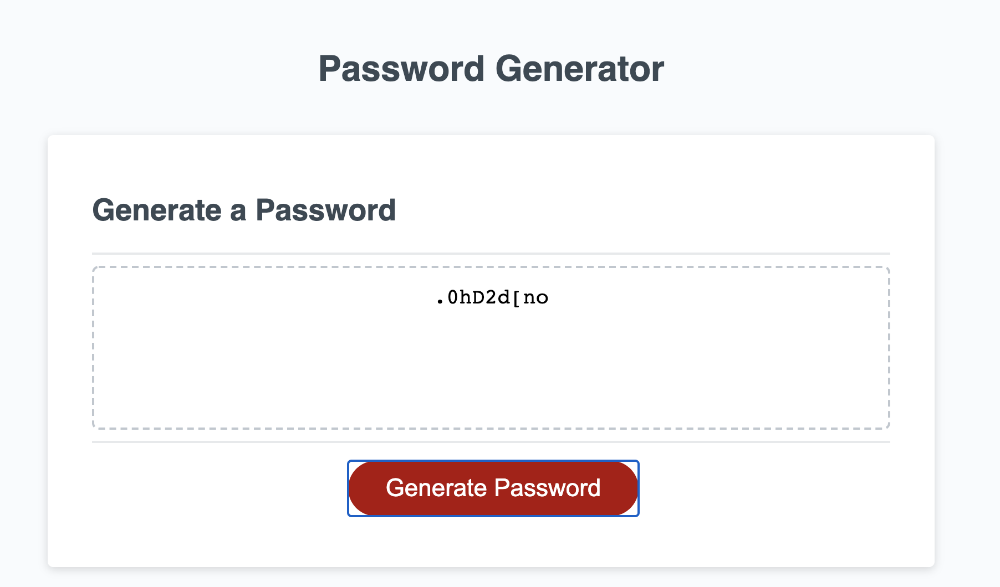

# Password-Generator

## Description

In this project, my task is to use JavaScript to build a password genetator function. The purpose is to help user generates different passwords and make the network more security. After user inputs the length of password, and chooses different types of characters, this application will provide a password which meet the user's need.

## Requirements

1. Presented with a series of prompts for password criteria.
2. Selected which criteria to include in the password.
3. A length of password at least 8 characters and no more than 128 characters.
4. Choose character types included in the password from lowercase, uppercase, numeric, and/or special characters.
5. Input should be valided and at least one character type should be selected.
6. Password is generated that matches the selected criteria.
7. Password is either display in an alert or written to the page.

## Link URL to GitHub Repository

https://github.com/jingwang6028/Password-Generator

## Link URL to the GitHub Page

https://jingwang6028.github.io/Password-Generator/

## Mock-Up Image

This page shows the web application's appearance and functionality. The prompt asked user to input password length.

This page shows the the output when the password is generated.

